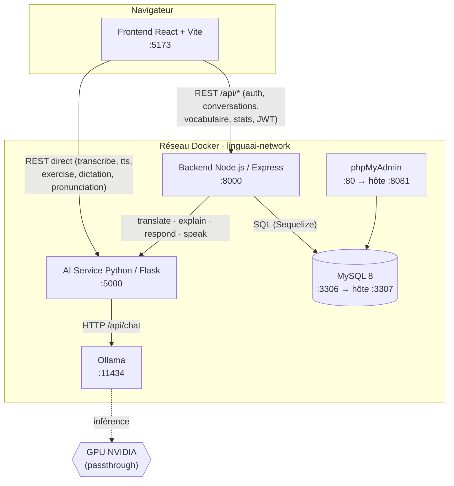
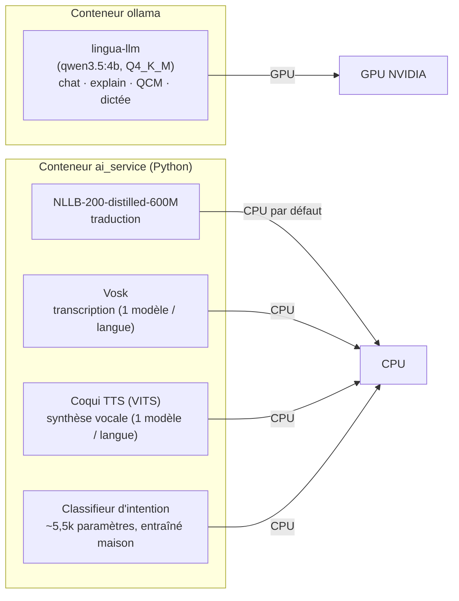
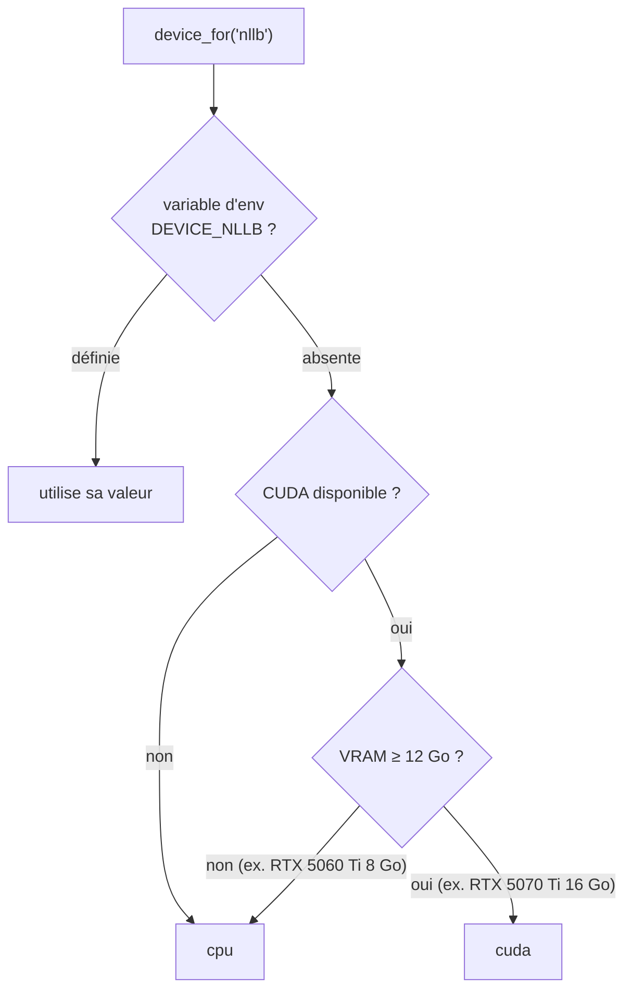
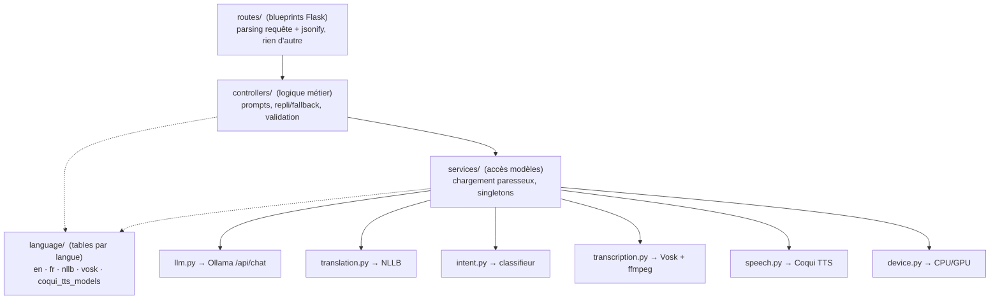
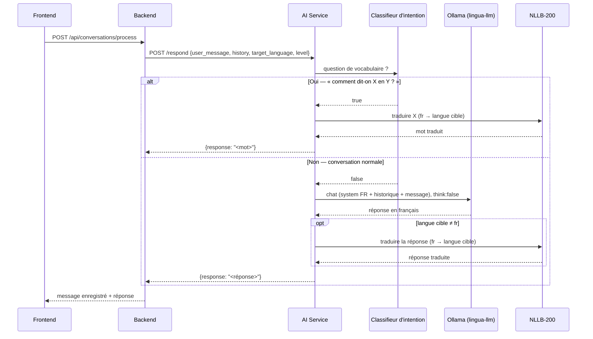
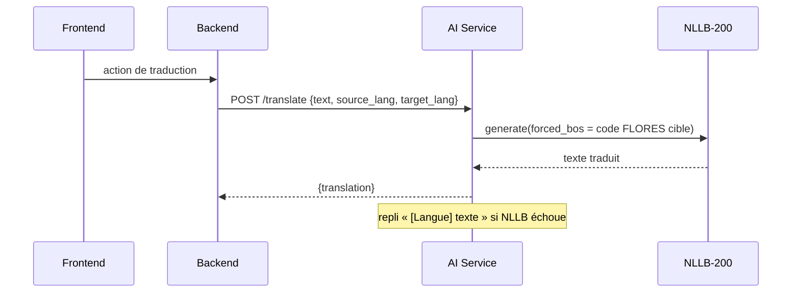
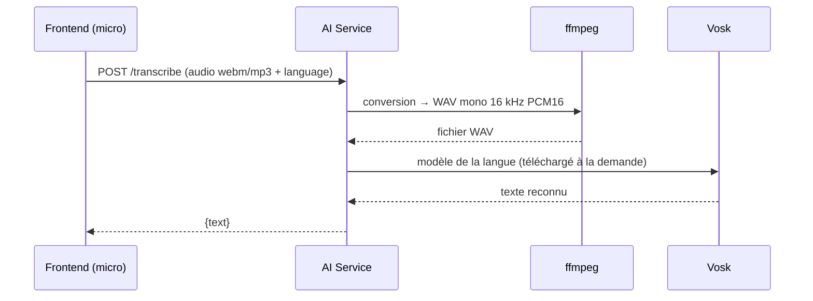
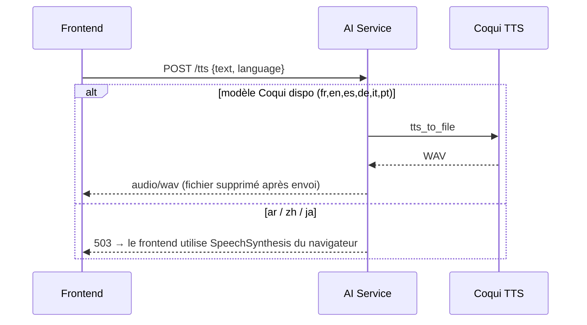
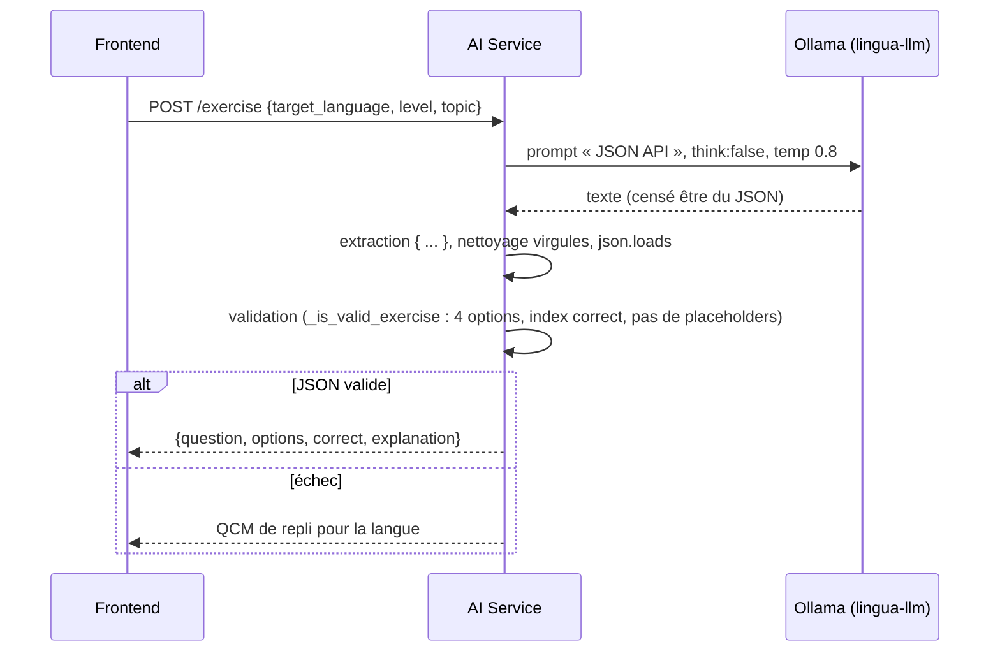
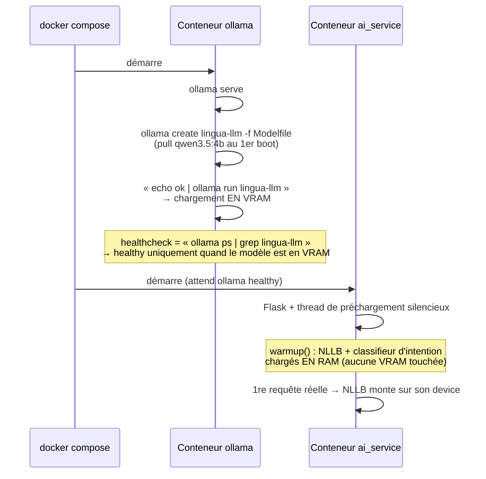

# LinguaAI

Application web d'apprentissage des langues avec assistant IA — traduction, transcription vocale, synthèse vocale, explications grammaticales, conversation et exercices générés automatiquement.

Tous les modèles IA tournent **en local**, sans clé API externe ni coût d'usage :

| Brique | Où elle tourne | Matériel |
|---|---|---|
| LLM (chat, explications, QCM, dictée) | **Ollama** — conteneur dédié | GPU (NVIDIA) |
| Traduction (NLLB‑200) | Process Python du service IA | CPU par défaut, GPU possible |
| Transcription (Vosk) | Process Python du service IA | CPU |
| Synthèse vocale (Coqui TTS) | Process Python du service IA | CPU |
| Classifieur d'intention (modèle maison) | Process Python du service IA | CPU |

Langues supportées : **français, anglais, espagnol, allemand, arabe, italien, portugais, chinois, japonais**.

---

## Sommaire

- [Fonctionnalités](#fonctionnalités)
- [Architecture globale](#architecture-globale)
- [Stack technique](#stack-technique)
- [Les modèles IA](#les-modèles-ia)
- [Le service IA en détail](#le-service-ia-en-détail)
- [Flux de données](#flux-de-données)
- [Démarrage silencieux & chargement des modèles](#démarrage-silencieux--chargement-des-modèles)
- [Démarrage avec Docker](#démarrage-avec-docker-recommandé)
- [Démarrage manuel](#démarrage-manuel-sans-docker)
- [Structure du projet](#structure-du-projet)
- [Configuration](#configuration)
- [Référence des endpoints](#référence-des-endpoints)
- [Dépannage](#dépannage)

---

## Fonctionnalités

| Fonctionnalité | Description | Modèle |
|---|---|---|
| **Traduction** | Texte ↔ texte entre 9 langues | NLLB‑200‑distilled‑600M |
| **Transcription (STT)** | Dicter un texte à l'oral | Vosk (un modèle par langue) |
| **Synthèse vocale (TTS)** | Écouter une traduction | Coqui TTS (fr, en, es, de, it, pt) — repli navigateur pour ar/zh/ja |
| **Explications** | Grammaire, vocabulaire, contexte culturel, adaptés au niveau | LLM `lingua-llm` |
| **Conversation IA** | Coach conversationnel avec suivi de contexte | LLM `lingua-llm` + NLLB |
| **Exercices** | Génération de QCM dans la langue cible | LLM `lingua-llm` |
| **Dictée** | Génération de textes de dictée par niveau | LLM `lingua-llm` |
| **Prononciation** | Score 0–100 + retour personnalisé | comparaison lexicale + LLM |
| **Suivi de progression** | Statistiques, vocabulaire, flashcards (répétition espacée) | — |

---

## Architecture globale

Cinq conteneurs sur un réseau Docker privé (`linguaai-network`).



**Deux chemins vers le service IA :**

- Le **backend** appelle l'IA pour tout ce qui touche à une conversation persistée (`/translate`, `/explain`, `/respond`, `/speak`).
- Le **frontend** appelle l'IA directement pour les activités « one‑shot » sans persistance (`/transcribe`, `/tts`, `/exercise`, `/dictation-text`, `/pronunciation`).

---

## Stack technique

| Couche | Technologies |
|---|---|
| **Frontend** | React 19, Vite, Tailwind CSS, React Router, lucide-react, react-icons |
| **Backend** | Node.js, Express, Sequelize, MySQL, JWT, bcryptjs, axios |
| **AI Service** | Python 3.10, Flask, Flask-CORS, PyTorch, Transformers, Vosk, Coqui TTS, requests |
| **LLM runtime** | Ollama (modèle dérivé `lingua-llm` basé sur `qwen3.5:4b`) |
| **Base de données** | MySQL 8 |
| **Orchestration** | Docker Compose |

---

## Les modèles IA



| Modèle | Rôle | Runtime | Device | Taille (cache) |
|---|---|---|---|---|
| `lingua-llm` (`qwen3.5:4b` Q4) | Explications, conversation, QCM, dictée, feedback prononciation | Ollama | **GPU** | ~2,8–3,5 Go |
| NLLB‑200‑distilled‑600M | Traduction 9 langues | Transformers | CPU (`DEVICE_NLLB=cuda` pour forcer GPU) | ~2,4 Go |
| Vosk | Speech‑to‑Text, un modèle par langue | vosk | CPU | 50–300 Mo / langue |
| Coqui TTS (VITS) | Text‑to‑Speech (fr, en, es, de, it, pt) | coqui‑tts | CPU (`DEVICE_TTS=cuda` pour forcer GPU) | 100–200 Mo / langue |
| Classifieur d'intention | Détecte « comment dit‑on X en Y ? » → route vers NLLB | PyTorch | CPU | négligeable |

### Répartition GPU / CPU

Le module [`ai_service/services/device.py`](ai_service/services/device.py) décide à l'exécution, **sans rien coder en dur** :



Le LLM (le plus lourd) est toujours sur GPU via Ollama, qui gère seul l'offload des couches selon la VRAM. NLLB reste sur CPU sous 12 Go de VRAM pour ne pas entrer en concurrence avec le LLM (~1–2 s/phrase, acceptable). Overrides : `DEVICE_NLLB`, `DEVICE_TTS` dans `ai_service/.env`.

---

## Le service IA en détail

Le service Python est découpé en couches (même logique MVC que le backend Node) :



| Endpoint | Route | Controller | Services |
|---|---|---|---|
| `POST /translate` | `routes/translation.py` | `translation_controller` | `translation` |
| `POST /explain` | `routes/explain.py` | `explain_controller` | `llm` |
| `POST /respond` | `routes/conversation.py` | `conversation_controller` | `llm`, `translation`, `intent` |
| `POST /transcribe` | `routes/speech.py` | `speech_controller` | `transcription` |
| `POST /tts` · `POST /speak` | `routes/speech.py` | `speech_controller` | `speech` |
| `POST /exercise` · `POST /dictation-text` | `routes/practice.py` | `practice_controller` | `llm` |
| `POST /pronunciation` | `routes/pronunciation.py` | `pronunciation_controller` | `llm` |
| `GET /health` · legacy `/lesson` `/check` `/progress` | `routes/misc.py` | `misc_controller` | — |

---

## Flux de données

### Conversation avec le coach IA (`/respond`)

Le LLM répond **en français** (langue où il est le plus fiable), puis NLLB traduit vers la langue cible. Les questions de vocabulaire (« comment dit‑on X en Y ? ») court‑circuitent le LLM et passent directement par NLLB.



### Traduction (`/translate`)



### Transcription vocale (`/transcribe`)



### Synthèse vocale (`/tts`)



### Génération d'un QCM (`/exercise`)



---

## Démarrage silencieux & chargement des modèles

Au lancement de la stack :



- **LLM** : chargé en VRAM dès le démarrage du conteneur `ollama` → la première requête utilisateur ne paie pas le *cold start*. `OLLAMA_KEEP_ALIVE=-1` le garde résident.
- **NLLB + intent** : préchargés **en RAM** par un thread de fond de `ai_service` (« démarrage silencieux ») — pas de réservation VRAM à vide ; le device réel est engagé à la première traduction.
- **Vosk / Coqui** : chargés à la demande (un modèle par langue), puis mis en cache dans les volumes Docker.

Contrepartie : `docker compose up` met plus longtemps à rendre `ai_service` disponible (temps du `ollama run` initial + pull du modèle au tout premier lancement).

---

## Démarrage avec Docker (recommandé)

### Prérequis

- [Docker](https://www.docker.com/) + Docker Compose v2
- **GPU NVIDIA + pilote à jour** et le support GPU de Docker :
  - Windows : Docker Desktop avec moteur **WSL 2** + pilote NVIDIA
  - Linux : [NVIDIA Container Toolkit](https://docs.nvidia.com/datacenter/cloud-native/container-toolkit/latest/install-guide.html)
  - Cartes **RTX 50xx (Blackwell)** : l'image `ollama/ollama:latest` embarque un runtime CUDA compatible.

> **Pas de GPU ?** Le service `ollama` déclare une réservation GPU dans `docker-compose.yml` (`deploy.resources.reservations.devices`). Sans GPU, retirez ce bloc — Ollama tournera sur CPU (le LLM sera nettement plus lent).

### Lancer

```bash
docker compose up -d --build

# Suivre le 1er boot (pull qwen3.5:4b + chargement VRAM) :
docker compose logs -f ollama
```

### Services exposés

| Service | URL | Détail |
|---|---|---|
| Frontend | http://localhost:5173 | Application React |
| Backend API | http://localhost:8000 | REST `/api/*`, JWT |
| AI Service | http://localhost:5000 | Flask |
| Ollama | http://localhost:11434 | API LLM |
| phpMyAdmin | http://localhost:8081 | `root` / `root` |
| MySQL | localhost:3307 | base `linguaai` |

Arrêter : `docker compose down` — ajouter `-v` pour supprimer aussi les volumes (caches de modèles : `hf_cache`, `vosk_cache`, `tts_cache`, `ollama_models`, `mysql_data`).

---

## Démarrage manuel (sans Docker)

Quatre briques à lancer.

### 1. Base de données

```bash
mysql -u root -p < backend/database/schema.sql
```

### 2. Ollama (LLM)

```bash
# Installer Ollama : https://ollama.com/download
ollama serve                                              # dans un terminal

# Construire le modèle dérivé (pull de qwen3.5:4b inclus)
ollama create lingua-llm -f ai_service/ollama/Modelfile
```

### 3. AI Service (Python)

```bash
cd ai_service
python -m venv venv
venv\Scripts\activate            # Windows
# source venv/bin/activate       # Linux/Mac
pip install -r requirements.txt

# Pointer vers l'Ollama local
#   .env → AI_OLLAMA_URL=http://localhost:11434
#          LLM_MODEL=lingua-llm

python app.py
```

`ffmpeg` est requis pour la transcription (`ffmpeg -version`). Le service démarre sur `http://localhost:5000`.

Pour mettre **NLLB sur GPU** : dans `requirements.txt`, remplacer `--extra-index-url https://download.pytorch.org/whl/cpu` par `.../whl/cu128` (obligatoire pour les cartes Blackwell), réinstaller, puis `DEVICE_NLLB=cuda`.

### 4. Backend (Node.js)

```bash
cd backend
npm install
npm start          # http://localhost:8000
```

### 5. Frontend (React)

```bash
cd frontend
npm install
npm run dev        # http://localhost:5173
```

---

## Structure du projet

```
ahmed/
├── docker-compose.yml
├── database/                      # schéma SQL
│
├── frontend/                      # React + Vite
│   └── src/
│       ├── pages/                 # Dashboard, Conversation, Vocabulary, Flashcards,
│       │                          #   Exercises, Dictation, Progress, Profile...
│       ├── components/
│       ├── contexts/              # AuthContext
│       ├── hooks/                 # useAudioRecorder, useSpeak
│       └── services/api.js        # appels Backend (/api/*) + AI Service direct
│
├── backend/                       # Node.js / Express
│   └── src/
│       ├── config/                # connexion Sequelize
│       ├── controllers/           # auth, user, conversation, vocabulary
│       ├── middleware/            # auth JWT
│       ├── models/                # User, Conversation, Message, Vocabulary, UserStats
│       ├── routes/                # /api/auth, /api/user, /api/conversations, /api/vocabulary
│       └── services/aiService.js  # client HTTP vers le service IA
│
└── ai_service/                    # Python / Flask
    ├── app.py                     # app factory + thread de préchargement silencieux
    ├── config.py                  # variables d'environnement
    ├── language/                  # tables par langue (1 fichier chacune)
    │   ├── en.py  fr.py  nllb.py  vosk.py  coqui_tts_models.py
    ├── services/                  # accès modèles (chargement paresseux)
    │   ├── llm.py                 #   client Ollama
    │   ├── translation.py         #   NLLB-200
    │   ├── intent.py              #   classifieur d'intention + regex
    │   ├── transcription.py       #   Vosk + ffmpeg
    │   ├── speech.py              #   Coqui TTS
    │   └── device.py              #   sélection CPU/GPU par rôle
    ├── controllers/               # logique métier (prompts, fallbacks, validation)
    ├── routes/                    # blueprints Flask
    ├── models/                    # classifieur d'intention entraîné (.pt + vocab)
    ├── ollama/
    │   ├── Modelfile              # définition de lingua-llm
    │   └── entrypoint.sh          # serve + create + chargement VRAM
    └── train_intent_model.py      # entraînement du classifieur (hors ligne)
```

---

## Configuration

### `ai_service/.env`

| Variable | Défaut | Rôle |
|---|---|---|
| `PORT` | `5000` | port Flask |
| `AI_OLLAMA_URL` | `http://ollama:11434` | URL du serveur Ollama |
| `LLM_MODEL` | `lingua-llm` | nom du modèle Ollama |
| `NLLB_MODEL` | `facebook/nllb-200-distilled-600M` | modèle de traduction |
| `VOSK_CACHE_DIR` | `/root/.cache/vosk` | cache des modèles Vosk |
| `INTENT_MODEL_DIR` | `ai_service/models` | dossier du classifieur |
| `DEVICE_NLLB` | *(auto)* | `cpu` / `cuda` — force le device de NLLB |
| `DEVICE_TTS` | `cpu` | `cpu` / `cuda` — force le device de Coqui TTS |

### `backend` (variables d'environnement)

`NODE_ENV`, `PORT` (`8000`), `DB_HOST`, `DB_PORT`, `DB_NAME`, `DB_USER`, `DB_PASSWORD`, `JWT_SECRET`, `AI_SERVICE_URL` (`http://ai_service:5000`).

### `frontend` (variables Vite)

| Variable | Défaut | Rôle |
|---|---|---|
| `VITE_API_URL` | `http://localhost:8000` | backend Node |
| `VITE_AI_URL` | `http://localhost:5000` | service IA (appels directs) |

### Modèle LLM — `ai_service/ollama/Modelfile`

```dockerfile
FROM qwen3.5:4b
PARAMETER temperature 0.7      # sampling Qwen3 en mode non-thinking
PARAMETER top_p 0.8
PARAMETER top_k 20
PARAMETER repeat_penalty 1.05
PARAMETER num_ctx 4096         # historiques courts → KV-cache réduit
PARAMETER num_gpu 999          # offload complet (4B Q4 tient sur 8 Go)
PARAMETER num_predict 512
```

Les appels passent `"think": false` → pas de bloc `<think>` (latence réduite). Chaque route surcharge `num_predict` / `temperature`.

Changer de modèle : éditer le `FROM`, ou poser `LLM_MODEL=qwen3:4b` (etc.) dans `.env` pour tester sans rebuild.

---

## Référence des endpoints

### Service IA — `http://localhost:5000`

| Méthode | Endpoint | Corps | Réponse |
|---|---|---|---|
| `GET` | `/health` | — | `{status, ai}` |
| `POST` | `/translate` | `{text, source_lang, target_lang}` | `{translation}` |
| `POST` | `/explain` | `{text, language, level}` | `{explanation}` |
| `POST` | `/respond` | `{user_message, conversation_history, target_language, level}` | `{response}` |
| `POST` | `/transcribe` | `multipart` : `audio` + `language` | `{text}` |
| `POST` | `/tts` | `{text, language}` | `audio/wav` ou `503` |
| `POST` | `/exercise` | `{target_language, level, topic}` | `{question, options[4], correct, explanation}` |
| `POST` | `/dictation-text` | `{target_language, level}` | `{text}` |
| `POST` | `/pronunciation` | `{expected, actual}` | `{score, feedback}` |
| `POST` | `/speak` | `{text, language}` | `{text, language, ready}` *(legacy)* |

`level` ∈ `debutant` · `intermediaire` · `avance`. Codes langue : `fr en es de ar it pt zh ja`.

### Backend — `http://localhost:8000/api`

| Méthode | Endpoint | Auth | Rôle |
|---|---|---|---|
| `POST` | `/auth/register` · `/auth/login` | — | inscription / connexion (JWT) |
| `GET` `PUT` | `/user/me` | JWT | profil |
| `GET` | `/user/stats` | JWT | statistiques |
| `POST` | `/user/activity` | JWT | enregistrer une activité |
| `GET` `POST` | `/conversations` | JWT | lister / créer |
| `GET` | `/conversations/:id/messages` | JWT | messages d'une conversation |
| `POST` | `/conversations/messages` | JWT | ajouter un message |
| `POST` | `/conversations/process` | JWT | message utilisateur → réponse IA |
| `GET` | `/vocabulary` · `/vocabulary/due` · `/vocabulary/export` | JWT | vocabulaire, révisions dues, export |
| `POST` | `/vocabulary` | JWT | ajouter un mot |
| `PUT` | `/vocabulary/:id/progress` | JWT | mettre à jour la progression (répétition espacée) |
| `DELETE` | `/vocabulary/:id` | JWT | supprimer un mot |

### Exemples

```bash
curl http://localhost:5000/health

curl -X POST http://localhost:5000/translate \
  -H "Content-Type: application/json" \
  -d '{"text":"Bonjour le monde","source_lang":"fr","target_lang":"en"}'

curl -X POST http://localhost:5000/explain \
  -H "Content-Type: application/json" \
  -d '{"text":"Je suis allé au marché","language":"fr","level":"debutant"}'
```

---

## Dépannage

| Symptôme | Piste |
|---|---|
| `docker compose up` échoue sur `ollama` (`could not select device driver`) | GPU non exposé à Docker → installer le support GPU, ou retirer le bloc `deploy.resources` du service `ollama` (Ollama tournera sur CPU). |
| `ai_service` reste en attente au démarrage | Normal au **premier** lancement : Ollama télécharge `qwen3.5:4b` puis le charge en VRAM. Suivre `docker compose logs -f ollama`. |
| Réponses IA lentes **uniquement** juste après le démarrage | Cold start du LLM en VRAM et/ou téléchargement de NLLB (~2,4 Go) au 1er `/translate`. Les appels suivants sont rapides. |
| La transcription échoue | `ffmpeg` absent du PATH (`ffmpeg -version`). Inclus dans le Dockerfile. |
| Le TTS renvoie 503 pour ar / zh / ja | Attendu : pas de modèle Coqui → le frontend bascule sur `SpeechSynthesis` du navigateur. |
| `entrypoint.sh: not found` dans le conteneur ollama | Fins de ligne CRLF. Le `.gitattributes` force `*.sh` en LF ; sinon `sed -i 's/\r$//' ai_service/ollama/entrypoint.sh`. |
| LLM très lent malgré un GPU | Vérifier `docker compose exec ollama ollama ps` (le modèle doit être `100% GPU`). Sur carte 8 Go, garder NLLB sur CPU (`DEVICE_NLLB=cpu`). |
| Le frontend ne reçoit rien | Vérifier que les 5 conteneurs tournent (`docker compose ps`) et les URLs `VITE_API_URL` / `VITE_AI_URL`. |

---

## Documentation complémentaire

- [AI_SETUP_GUIDE.md](AI_SETUP_GUIDE.md) — installation détaillée du service IA
- [ai_service/README.md](ai_service/README.md) — endpoints et modèles du service IA
- [backend/README.md](backend/README.md) — structure et configuration du backend
